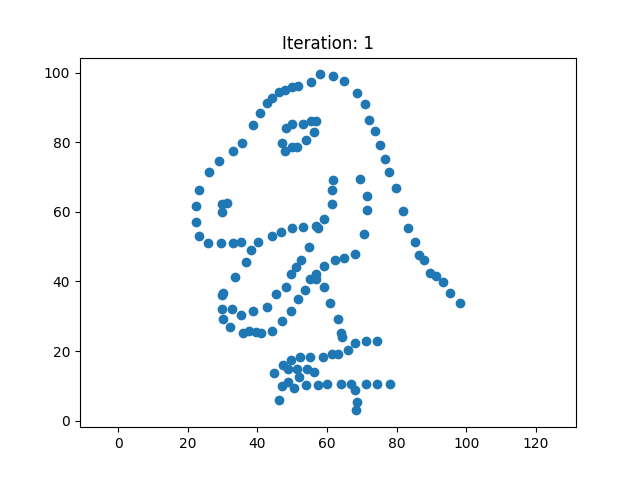

# Disintegrating Dinosaurs, but fast

This is an application based on [Same Stats, Different Graphs](https://www.autodesk.com/research/publications/same-stats-different-graphs), where we speed up the process of transforming the graphs and add some functionality to transform graphs into the form of 16x16 images. Our implementation of the algorithm in C++ is much faster than the original algorithm in Python: 100000 iterations can take 3+ minutes in the original implementation. Our implementation does it in 0.08 seconds. A detailed list of our optimizations can be found in [Disintegrating Dinosaurs, but fast](paper.pdf).



```text
initial stats:
mean x: 54.2633
mean y: 47.8323
sd x:   16.706
sd y:   26.8404
correlation:    -0.0644719

new stats:
mean x: 54.2653
mean y: 47.8312
sd x:   16.7054
sd y:   26.8412
correlation:    -0.0600962
```

This repository originated from Maurice Wenig's and Nick Würflein's project for the lecture "Algorithm Engineering" at the Friedrich-Schiller-University Jena.

## Build

```text
./build.sh
```

## Run

You can either run the executable manually or use the run script. The run script additionally visualizes the results of the transformation into `animations/animation.gif`.

```text
./run.sh

or

./build/main [options]
Allowed options:
    --help                produce help message
    --iterations arg      set number of iterations
    --out arg             set output path
    --in arg              set input path
    --form arg            choose target form
    --params arg          path to parameters file

Examples:
./build/main (uses default options)
./build/main --in ./data.csv --out ./out/out.csv --iterations 1000000
```

## Commandline Arguments

| argument   | default                     | description                                                                                                                                                                                                                                  |
| ---------- | --------------------------- | -------------------------------------------------------------------------------------------------------------------------------------------------------------------------------------------------------------------------------------------- |
| iterations | 1000000                     | Number of times a point is shaken into the direction of the given form. Shakes that do not keep the statistical properties, and are therefore thrown away, are also counted in the iterations.                                               |
| out        | ./out/out.csv               | Path to the final result. The final result is saved as a headerless `.csv` file. Along with the final result, a selected number of iterations (50) is saved in the same directory. The root directory of the given output file has to exist. |
| in         | ./data.csv                  | Path to a headerless `.csv` file where the initial data is stored.                                                                                                                                                                           |
| form       | ./example_forms/circle.json | Path to the target form. Target forms are `.json` files with a `type` and `parameters` that are specific to the `type` of the form. Example forms can be found in `./example_forms/`.                                                        |
| params     | ./parameters.json           | Path to the execution parameters. It is a `.json` file.                                                                                                                                                                                      |

## Parameters

| parameter    | default | description                                                                    |
| ------------ | ------- | ------------------------------------------------------------------------------ |
| shake        | 0.1     | determines how far points move when they are shaken                            |
| allowed_dist | 2       | how far points can move without the need to be closer to the mathematical form |
| digits       | 2       | how many decimal digits should stay the same when the points are shaken        |
| min_temp     | 0       | minimum temp for simulated annealing                                           |
| max_temp     | 0.4     | maximum temp for simulated annealing                                           |
